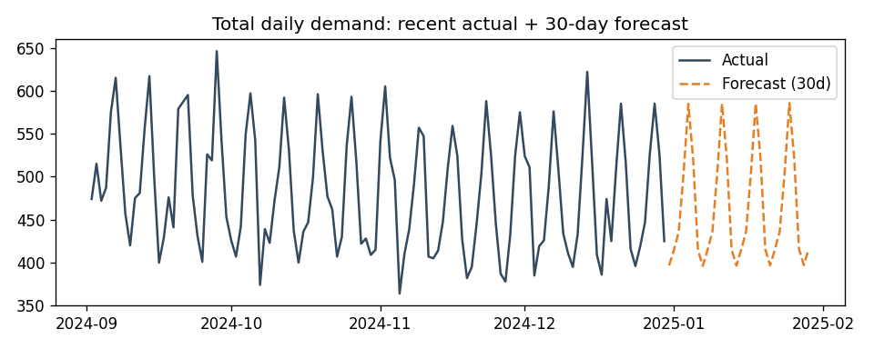
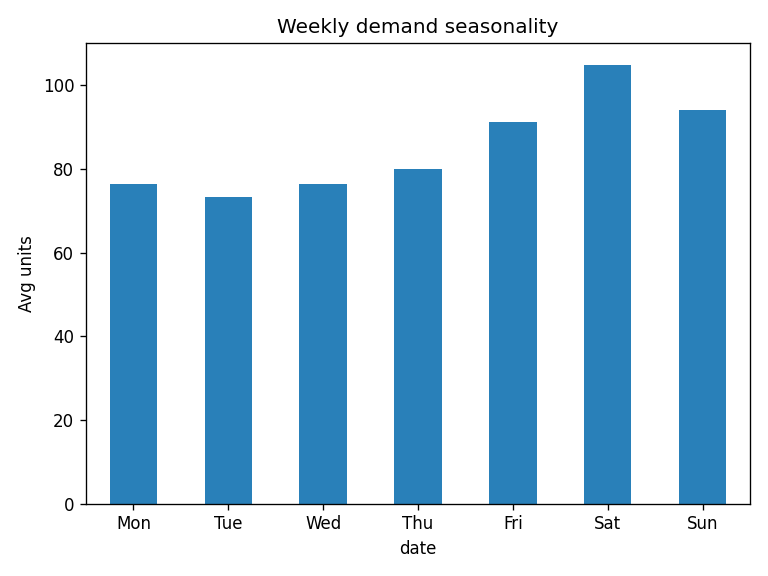
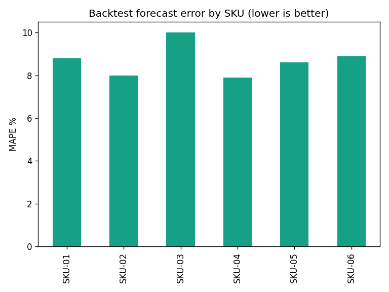
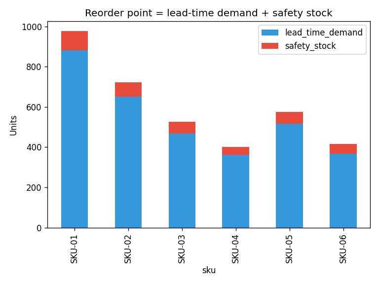

# Demand Forecasting & Inventory Optimization

Forecasts daily product demand and turns it into an **inventory plan** — safety stock,
reorder points, and order-up-to levels — that balances stockout risk against excess
inventory. Built with **Python time-series analysis** on a multi-SKU retail dataset.

## Key results

- Forecasts each SKU with **~8.7% average error (MAPE)** on a 60-day backtest.
- Captures **weekly seasonality** (weekend demand lift) and **trend** per product.
- Produces a per-SKU inventory plan at a **95% service level**: safety stock, reorder point, and order-up-to level.
- Reorder logic makes the stockout-vs-excess trade-off explicit and quantified.

## Visuals






## How to run

```bash
pip install -r requirements.txt
python generate_data.py   # creates sales.csv (6 SKUs x 2 years daily)
python forecast.py        # backtests, forecasts 30 days, builds the inventory plan
```

## Method

- **Model:** additive decomposition per SKU — linear **trend** + **weekly** (day-of-week)
  and **monthly** seasonal factors. Transparent and explainable, no black box.
- **Backtest:** hold out the last 60 days, forecast, and score with **MAPE** and **RMSE**.
- **Inventory optimization:** with a 7-day lead time and 95% service level,
  `safety stock = z * sigma * sqrt(lead time)` and
  `reorder point = lead-time demand + safety stock`, plus an order-up-to level covering the
  review period. Output is a per-SKU plan balancing stockout risk vs. holding cost.

## Files

`generate_data.py`, `forecast.py`, `forecast_30d.csv`, `inventory_recommendations.csv`,
`results.json`, `*.png`.

## Tech stack

Python, pandas, NumPy, matplotlib, time-series analysis.

> Data is synthetic but modeled on public retail demand datasets (e.g., Store Item Demand),
> so the workflow transfers directly to real sales/inventory data.
